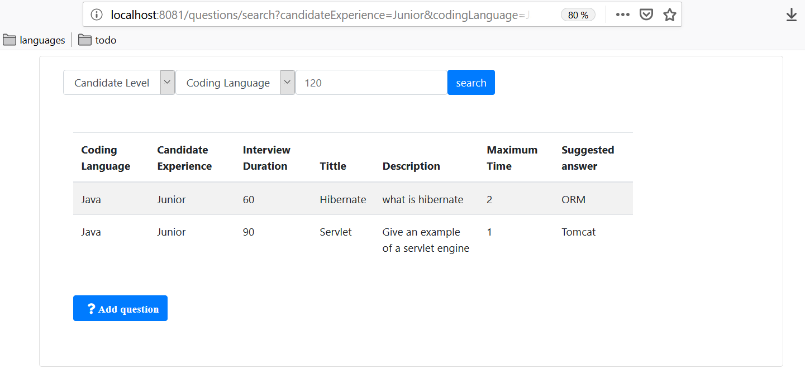

The Interviewer tool
====================

Overview
--------
This is a very simple web application allowing an interviewer
to select a set of questions based on the programming language,
the candidate experience and the interview duration threshold. 

Used technologies
---
 - Java 8
 - Spring Boot 2.1.6
 - Spring 5.1.8
 - thymeleaf 3.0.11
 - tomcat embed 9.0.21
 - H2 (In memory) database
 - Maven 3
 
Build
-----
    mvn clean install 
    java -jar target/interviewer-0.1.0.jar

Run
---
In your favorite browser enter the following local address
     http://localhost:8081/

you will see the following home page

    
There is no data in the database yet, we can add some questions
using the "Add question" button bellow (#S02)

Now after filling in some data we can use the search function (#S01)

> find the question for JavaScript medium developer, the maximum interview
time is 120 minutes

> find all the questions for a junior Java developer, when the maximum interview
time is 90 minutes

TODO
---
* Permanent storage datasource
* Log
* Junit
* Functional tests (mockito for example)
* input validation
* error handling (server exceptions handling, error page template, spans...)